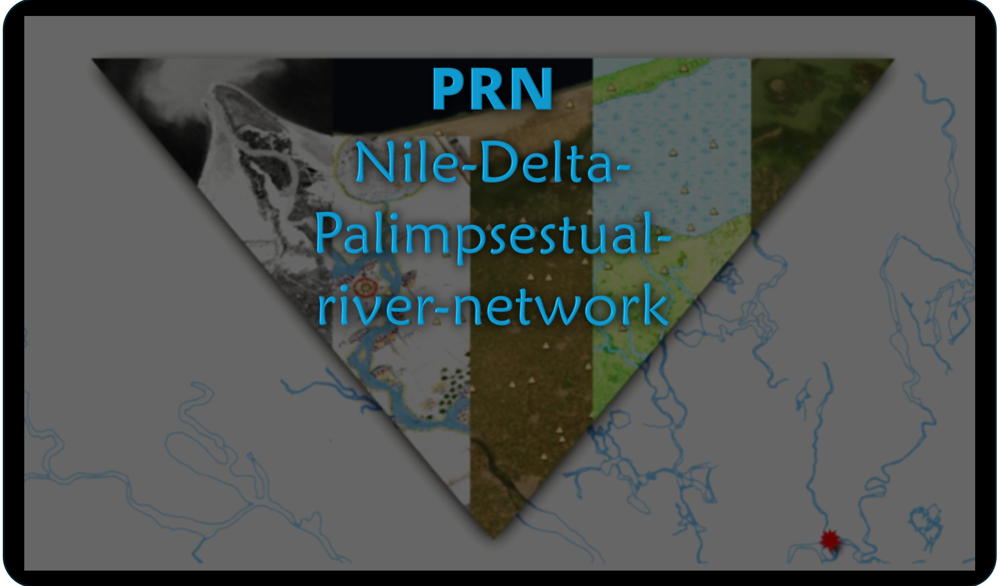
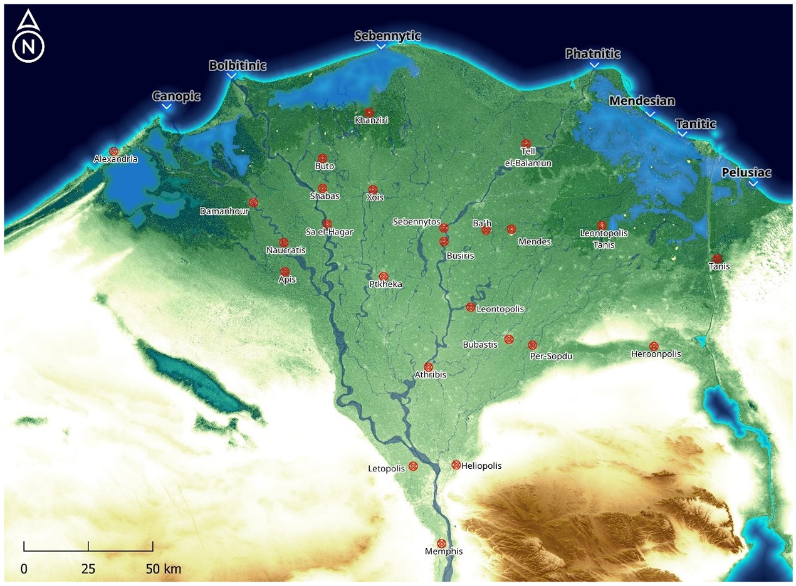
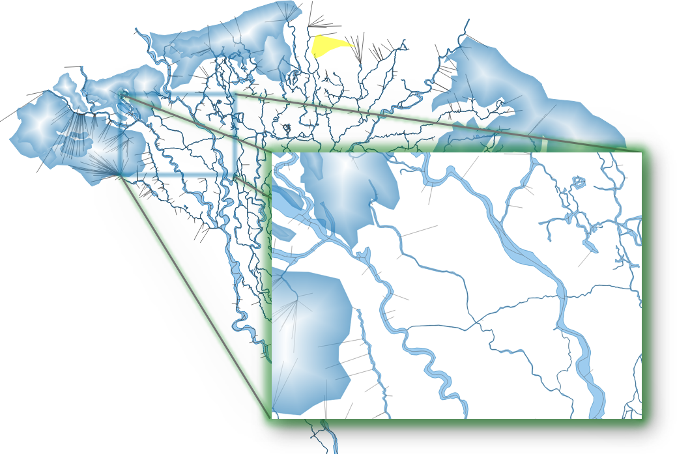

# Nile-Delta-Palimpsestual-river-network

These set of files represent a sum of traceable riverine features Hinojosa-Balino (2022) could identify using historical and archaeological mapping, geophysics, boreholes and published material irrespective of the temporality of the river channel (e.g. defunct channels also appear)

## Data

The data offered here was created as part of the PhD project Hinojosa-Baliño, I. (2022). Urban fluctuations in the north-central region of the Nile Delta: 4000 years of river and urban development in Egypt. [Doctoral, Durham University]. The these can be downloaded from [Durham eTheses](http://etheses.dur.ac.uk/14524/).

### Contents

- PRN (realistic). Palimpsestual river network with channel width represented with a realistic width based on different sources.
- Spider network combined with PRN (lines). Palimpsestual reconstructed river network with approximate <em>channel width, type of channel and potential speed</em> that a boat could have achieved in that specific channel. 
- Lagoons. This is a polygon layer representing the boundaries of lakes in the Nile Delta. This is just a background layer.

### Disclaimer

These files are offered for your knowledge to complement or support new historical research. They are not intended to support land ownership or as proof of land boundaries, or river dynamics in modern times. The river flood model presented in the thesis, did not try to recreate a paleolandscape but rather analyse how the Nile annual flood was using a known topography and an accurate —albeit palimpsestual— river network. "The Nile Delta might reflect how counteracting forces try to reach a dynamic equilibrium, where topography, geology, soil composition, centrifugal force, gravity or discharge regime have interacted for millennia and have, in fact, created a hydrological palimpsest where different river morphologies or shapes have been created" (Hinojosa-Balino 2022: 176). This is A river network, and it is based purely on geomorphological features that were linked or used to link known archaeological sites and historical phenomena.

The approach to reconstruct the Nile Delta River consisted in: 1. I did not focus on finding any particular branch or follow archaeological site patterns. I have traced the river network based on high-resolution digital elevation models (SRTM 30 and TandemX-DEM 12m), a series of georeferenced cartographical sources, and satellite imagery (Digital Globe, Google Earth historical images, Mapbox and Bing maps background layers or Landsat), including different sets of Corona images ranging from 1962 to 1968. Once I had a preliminary map, I looked for archaeological and geophysical data to correct, modify, erase or add features. This way, I tried to reduce my own bias by looking for a particular channel. Finally, I compared the network, performed minor adjustments and studied it with the EES database of archaeological sites. I traced all the hydrological features resembling a natural water channel and made no distinctions. This is the reason I called the Nile Delta River network a palimpsestual map because it represents the sum of all the traceable riverine features that I could identify or that have been identified using geophysics and boreholes irrespective of their temporality. Finally, I traced the river basin rather than the centre of the channel -PRN (realistic).
